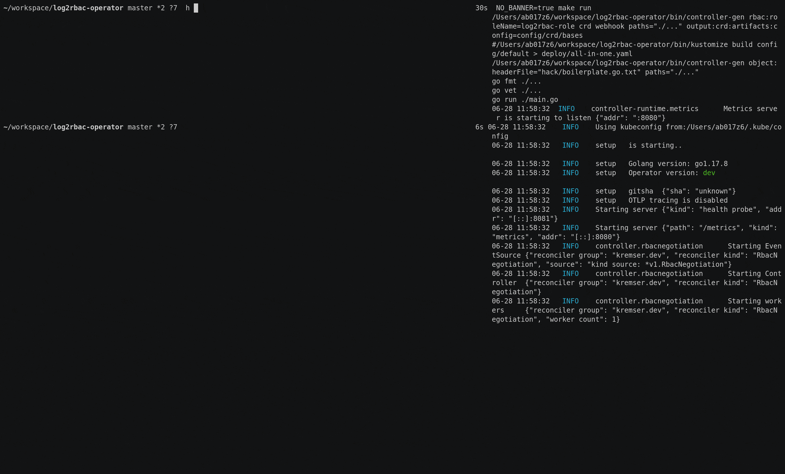

[](https://github.com/jkremser/log2rbac-operator/actions/workflows/ci.yaml?query=workflow%3A%22CI%22+branch%3Amaster)
[](https://github.com/jkremser/log2rbac-operator/releases) 
[](https://goreportcard.com/report/github.com/jkremser/log2rbac-operator)
[](https://artifacthub.io/packages/search?ts_query_web=log2rbac)
[](https://opensource.org/licenses/Apache-2.0)

[](https://doc.crds.dev/github.com/jkremser/log2rbac-operator)
[](https://bestpractices.coreinfrastructure.org/projects/6620)
<!-- [](https://hub.docker.com/r/jkremser/log2rbac) -->

# log2rbac-operator
Kubernetes operator that helps you to set up the RBAC rules for your application. If requested, it scans the application's log files
for authorization errors and adds them as exceptions/rights to the associated `{Cluster}Role`. It is like having a `sudo` command for your service accounts. However, with great power comes great responsibility. The goal of the tool is to find the minimum set of rights that is needed for your workload to run instead of using the cluster admin for everything.

User has to allow this process by creating a `RbacNegotiation` custom resource where they need to specify the app[*](#clarify) and `Role`.
Role can be either existing one or operator can create a new one for you and bind it to the service account that's configured with the deployment. Again if the service account is not there, it will be created by the operator.

<a name="clarify"></a>* App can be one of the following:
- `Deployment`
- `StatefulSet`
- `DaemonSet`
- `Service`
- `ReplicaSet`
- or key-value pair specifying the pod selector

By creating `RbacNegotiation` we start the "recording" regime for our workload in which the operator will be building this allow list of verbs, resources (rbac entries) for the given role.

[](https://asciinema.org/a/504672)
([pauseable demo](https://asciinema.org/a/504672))

This project is conceptually very similar to [`audit2rbac`](https://github.com/liggitt/audit2rbac). The main distinction here is that `log2rbac` is based on the 
controller pattern and on the output from the workloads, while `audit2rbac` uses the k8s' audit log and it's a "one-pass" CLI tool.

## Quick Start

```bash
# clone repo and
make deploy
```

alternatively install it using [all-in-one yaml](deploy/all-in-one.yaml)

```bash
kubectl apply -f http://bit.do/log2rbac
```

or helm:

```bash
helm repo add log2rbac https://jkremser.github.io/log2rbac-operator
helm repo update
helm -n log2rbac upgrade -i log2rbac log2rbac/log2rbac-operator --wait --create-namespace
```

Now when the operator was installed, let's deploy something that needs the special RBAC. Prometheus Operator is a good example.

```bash
kubectl create ns monitoring
kubectl apply -n monitoring -f https://github.com/prometheus-operator/kube-prometheus/raw/v0.10.0/manifests/prometheusOperator-deployment.yaml
```

This deployment will fail to start because of the missing rights to do its stuff. Let's request the RBAC negotiation process.

```bash
# create RbacNegotiation for Prometheus operator
cat <<CustomResource | kubectl apply -f -
apiVersion: kremser.dev/v1
kind: RbacNegotiation
metadata:
  name: for-prom
spec:
  for:
    namespace: monitoring
    kind: Deployment
    name: prometheus-operator
  role:
    name: foo
    isClusterRole: true
    createIfNotExist: true
CustomResource
```

```bash
# After some time, the Prometheus Operator should start and we should see.

k describe clusterrole foo
Name:         foo
Labels:       <none>
Annotations:  app.kubernetes.io/created-by=log2rbac
PolicyRule:
  Resources                                  Non-Resource URLs  Resource Names  Verbs
  ---------                                  -----------------  --------------  -----
  configmaps                                 []                 []              [list watch]
  namespaces                                 []                 []              [list watch]
  secrets                                    []                 []              [list watch]
  statefulsets.apps                          []                 []              [list watch]
  alertmanagerconfigs.monitoring.coreos.com  []                 []              [list]
  alertmanagers.monitoring.coreos.com        []                 []              [list]
  ...
```

Note: This set of rights was necessary only for the Prometheus operator to start. Once we start interacting with the subject of our RBAC negotiation process, the new code paths will be executed and possibly new rights will be requested. It might be a good idea to run e2e tests or at least have some script that calls the Prometheus operator's functionality (CRUDing all its CRDs). Last but not least, once we are happy with the resulting role and the rights it got, we should delete the RBAC negotiation custom resource to reduce the attack surface on our cluster.

You may want to capture the role in yaml format and store it as part of your infrastructure code in git (using [neat](https://github.com/itaysk/kubectl-neat)):

```bash
k get clusterrole foo -o yaml | k neat
```

## Kubectl Plugin

Installation:
```bash
kubectl krew install log2rbac
```

It can help with creating those `RbacNegotiation` custom resources by interactive TUI api.

It's located in [this repo](./kubectl-plugin)

## Observability

Operator's code has been instrumented by ~OpenTracing~ OpenTelemetry calls so that one can export the spans to Jaeger or Zipkin and
connect the dots. There is an example deployment using open telemetry collector running as a side-car container that exports the traces
to Jaeger that runs in its own deployment. To deploy this scenario, issue:

```bash
make deploy-otel
```

To check the Jaeger web UI for `log2rbac` traces, the easiest way is to

```bash
kubectl port-forward svc/jaeger-collector 16686
open http://localhost:16686
```


## Configuration

Following options are available as env variables for the operator:

| Variable name                              | Description                                           | default value        | 
|--------------------------------------------|-------------------------------------------------------|----------------------|
| `NO_COLOR`                                 | whether the colorful output in logs should be used    | `false`              |
| `NO_BANNER`                                | whether no ascii art should be printed during start   | `false`              |
| `SYNC_INTERVAL_AFTER_NO_RBAC_ENTRY_MINUTES` | if no rbac related entry was found in logs, how long to wait for the next check   | `5`                  |
| `SYNC_INTERVAL_AFTER_NO_LOGS_SECONDS`      | if it was not possible to get the logs, how long to wait for the next check       | `30`                 |
| `SYNC_INTERVAL_AFTER_POD_RESTART_SECONDS`  | how long to wait after rbac entry was added and pod was restarted by the operator | `20`                 |
| `SHOULD_RESTART_APP_PODS`                  | whether the operator should be restarting the pods after modifying the role       | `true`               |
| `TRACING_ENABLED`                          | if the application should be sending the traces to OTLP collector          | `false`              |
| `OTEL_EXPORTER_OTLP_ENDPOINT`              | `host:port` where the spans (traces) should be sent                        | `localhost:4318`     |
| `TRACING_SAMPLING_RATIO`                   | `float64` representing the ratio how often the span should be kept/dropped | `AlwaysSample ~ 1.0` |
